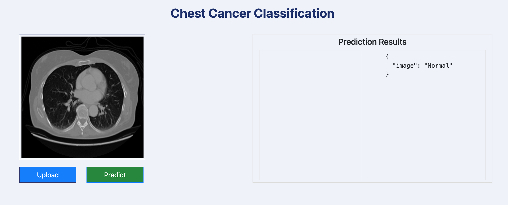

## Welcome To My Portfolio

---

### Selected Projects in Data Science, Machine and Deep Learning, Statistics, and NLP

**House Price Prediction using Machine Learning Algorithms and Web Application Approach**

This project is a deep dive into predictive analytics within the UK real estate market. By scraping data from Zoopla, it provides a detailed and current dataset of housing prices. Utilizing the Random Forest algorithm for its robustness and accuracy, the project successfully predicts house prices. The key outcome is a user-friendly web application, offering real-time price estimations valuable for buyers, realtors, and analysts. This project exemplifies the practical application of machine learning in real-world scenarios, combining technical data science skills with innovative problem-solving approaches.

[Check out my Colab Notebook](https://colab.research.google.com/drive/11CPcTIhV490sT0S_GOrAm7-ckDPQinQW?usp=sharing)

---

**End-to-End Chest Cancer Classification using MLflow-DVC with VGG16 Model, Web Application, and AWS Deployment**

This project represents a significant stride in medical imaging and cancer classification, focusing on chest cancer detection using the VGG16 model, a renowned architecture in deep learning along with advanced data management using DVC and lifecycle tracking through MLflow. A key feature of this project is the development and deployment of a user-friendly web application, hosted on AWS, facilitating real-time, accessible cancer classification based on chest imaging. This deployment on AWS ensures scalable and reliable access to the application, underscoring the project's commitment to applying cutting-edge machine learning techniques in a real-world, accessible manner. The project stands as a testament to the potential of deep learning in enhancing medical diagnostic practices.

[Check out my Github Link](https://github.com/Maryam-1/End-to-End-Chest-Cancer-Classification-using-MLflow-DVC)

---
**Statistical Analysis of Species Richness: Biodiversity Metrics Analysis with R**

This project delves into the intricacies of biodiversity by examining proportional species richness across various taxonomic groups. Using R, we've conducted a thorough investigation into the correlation between seven key variables, extending our analysis through hypothesis testing and multiple linear regression. The core objective is to compare a new biodiversity metric, BD7 — an average of species richness across Bees, Birds, Hoverflies, Ladybirds, Macromoths, Grasshoppers, and Vascular Plants — with the established BD11, which encompasses a broader spectrum of taxonomic groups. This comparative study aims to enhance our understanding of biodiversity indices and their implications for ecological research.

[Check out my Github Link](https://github.com/Maryam-1/Statistical-Analysis-of-Species-Richness-Biodiversity-Metrics-Analysis-with-R)

**Books Recommendation System**

This advanced project introduces a Smart Book Recommender System, meticulously crafted to transform how readers discover their next favorite book. Utilizing sophisticated algorithms that combine the strengths of collaborative filtering and content-based recommendations, the system excels in curating a personalized list of books. It seamlessly adapts to user feedback and reading habits, continuously refining its suggestions. Beyond mere recommendations, the system fosters a deeper engagement with literature, guiding users through an expansive universe of genres, authors, and narratives that align with their unique literary palate. This endeavor highlights the synergy between technology and the timeless love for reading.

[Check out my Github Link](https://github.com/Maryam-1/books-recommendation-system)

**Detection of Hate Speech using Deep NLP**

Hate speech identification involves using algorithms to discern if text is offensive or derogatory. For this initiative, I developed a detection system utilizing PyTorch to enhance a BERT model through fine-tuning techniques.

[Check out my Colab Notebook](https://colab.research.google.com/drive/1hHn4xAACR8J32h6VvGQi3F96SZDHcYmM?usp=sharing)

**Cryptocurrency Market Analysis Dashboard in PowerBI**

This Power BI dashboard offers an in-depth visualization of cryptocurrency market dynamics, capturing the volatile essence of digital assets. It provides a year-wise market capitalization analysis, juxtaposed against volume trends, to reveal the liquidity and investment patterns in the market. Core metrics such as the highest value attained, average market performance, and lowest price points are elegantly displayed, offering a snapshot of market extremes and variances. The dashboard is thoughtfully designed to cater to stakeholders interested in understanding the historical performance and potential forecasting of cryptocurrency valuations, making it an indispensable tool for strategic investment planning.

---

<!-- Remove above link if you don't want to attibute -->
